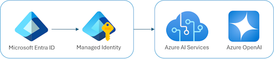

<!--
---
name: Extracción de entidades con salidas estructuradas de Azure OpenAI
description: Use las salidas estructuradas de Azure OpenAI y el SDK de Python de openai para extraer detalles de imágenes, issues de GitHub, PDFs y más.
languages:
- python
- bicep
- azdeveloper
products:
- azure-openai
- azure
page_type: sample
urlFragment: azure-openai-entity-extraction
---
-->
# Extracción de entidades con salidas estructuradas de Azure OpenAI (Python)

[](https://github.com/codespaces/new?hide_repo_select=true&ref=main&skip_quickstart=true&machine=basicLinux32gb&repo=784926917&devcontainer_path=.devcontainer%2Fdevcontainer.json&geo=WestUs2)
[](https://vscode.dev/redirect?url=vscode://ms-vscode-remote.remote-containers/cloneInVolume?url=https://github.com/Azure-Samples/azure-openai-entity-extraction)

Este repositorio incluye tanto la infraestructura como los archivos de Python necesarios para que puedas crear un deployment del modelo gpt-4o en Azure OpenAI y luego realizar extracción de entidades utilizando el [modo de salidas estructuradas](https://learn.microsoft.com/azure/ai-services/openai/how-to/structured-outputs?tabs=python-secure) y el SDK de Python de openai. Se incluyen scripts de ejemplo para extraer detalles de imágenes, PDFs, páginas web e issues de GitHub.

* [Características](#características)
* [Comenzando](#comenzando)
  * [GitHub Codespaces](#github-codespaces)
  * [VS Code Dev Containers](#vs-code-dev-containers)
  * [Entorno local](#entorno-local)
* [Despliegue](#despliegue)
* [Ejecutando los ejemplos de Python](#ejecutando-los-ejemplos-de-python)
* [Guía](#guía)
  * [Costos](#costos)
  * [Directrices de seguridad](#directrices-de-seguridad)
* [Recursos](#recursos)

## Características

* Aprovisiona una cuenta de Azure OpenAI con autenticación sin claves habilitada
* Otorga el rol RBAC de "Cognitive Services OpenAI User" a tu cuenta de usuario
* Despliega un modelo gpt-4o, versión 2024-08-06 (la [única versión compatible con salidas estructuradas](https://learn.microsoft.com/azure/ai-services/openai/how-to/structured-outputs?tabs=python-secure#supported-models))
* Los scripts de ejemplo usan el [paquete de Python openai](https://pypi.org/project/openai/) y [modelos Pydantic](https://docs.pydantic.dev/) para hacer solicitudes de salidas estructuradas

### Diagrama de arquitectura



## Comenzando

Tienes varias opciones para comenzar con esta plantilla.
La forma más rápida de comenzar es GitHub Codespaces, ya que configurará todas las herramientas por ti, pero también puedes [configurarlo localmente](#entorno-local).

### GitHub Codespaces

Puedes ejecutar esta plantilla virtualmente usando GitHub Codespaces. El botón abrirá una instancia de VS Code basada en web en tu navegador:

1. Abre la plantilla (esto puede tomar varios minutos):

    [](https://codespaces.new/Azure-Samples/azure-openai-entity-extraction)

2. Abre una ventana de terminal
3. Continúa con los [pasos de despliegue](#despliegue)

### VS Code Dev Containers

Una opción relacionada es VS Code Dev Containers, que abrirá el proyecto en tu VS Code local usando la [extensión Dev Containers](https://marketplace.visualstudio.com/items?itemName=ms-vscode-remote.remote-containers):

1. Inicia Docker Desktop (instálalo si aún no está instalado)
2. Abre el proyecto:

    [](https://vscode.dev/redirect?url=vscode://ms-vscode-remote.remote-containers/cloneInVolume?url=https://github.com/azure-samples/azure-openai-entity-extraction)

3. En la ventana de VS Code que se abre, una vez que aparezcan los archivos del proyecto (esto puede tomar varios minutos), abre una ventana de terminal.
4. Continúa con los [pasos de despliegue](#despliegue)

### Entorno local

1. Asegúrate de que las siguientes herramientas estén instaladas:

    * [Azure Developer CLI (azd)](https://aka.ms/install-azd)
    * [Python 3.9+](https://www.python.org/downloads/)

2. Crea un nuevo directorio llamado `azure-openai-entity-extraction` y clona esta plantilla en él usando la CLI `azd`:

    ```shell
    azd init -t azure-openai-entity-extraction
    ```

    También puedes usar git para clonar el repositorio si lo prefieres.

3. Continúa con los [pasos de despliegue](#despliegue)

## Despliegue

1. Inicia sesión en Azure:

    ```shell
    azd auth login
    ```

    Para usuarios de GitHub Codespaces, si el comando anterior falla, intenta:

   ```shell
    azd auth login --use-device-code
    ```

2. Aprovisiona la cuenta de OpenAI:

    ```shell
    azd provision
    ```

    Te pedirá que proporciones un nombre de entorno `azd` (como "entityext"), selecciones una suscripción de tu cuenta de Azure y selecciones una [ubicación donde el modelo de OpenAI esté disponible](https://learn.microsoft.com/azure/ai-services/openai/concepts/models#standard-deployment-model-availability) (como "canadaeast"). Luego aprovisionará los recursos en tu cuenta y desplegará el código más reciente.

    ⚠️ Si obtienes un error o tiempo de espera con el despliegue, cambiar la ubicación puede ayudar, ya que puede haber restricciones de disponibilidad para el recurso de OpenAI. Para cambiar la ubicación ejecuta:

    ```shell
    azd env set AZURE_LOCATION "nombredetunuevaubicacion"
    ```

3. Cuando `azd` haya terminado, deberías tener una cuenta de OpenAI que puedes usar localmente cuando hayas iniciado sesión en tu cuenta de Azure, y ahora debería existir un archivo `.env` con tu configuración de Azure OpenAI.

4. Luego puedes proceder a [ejecutar los ejemplos de Python](#ejecutando-los-ejemplos-de-python).

## Ejecutando los ejemplos de Python

Para ejecutar los ejemplos, necesitarás haber [desplegado la cuenta de Azure OpenAI](#despliegue) o usar GitHub models.

1. Verifica que el archivo `.env` exista en la raíz del proyecto. Si [desplegaste una cuenta de Azure OpenAI](#despliegue), debería haberse creado para ti y verse así:

    ```shell
    OPENAI_HOST=azure
    AZURE_OPENAI_GPT_DEPLOYMENT=gpt-4o
    AZURE_OPENAI_SERVICE=nombre-de-tu-servicio
    AZURE_TENANT_ID=tu-tenant-id-1234
    ```

    Si estás usando GitHub models, crea un archivo `.env` con el siguiente contenido:

    ```shell
    OPENAI_HOST=github
    GITHUB_TOKEN=
    ```

    Puedes crear un token de GitHub siguiendo la [documentación de GitHub](https://docs.github.com/en/github/authenticating-to-github/keeping-your-account-and-data-secure/creating-a-personal-access-token),
    o abrir este proyecto dentro de GitHub Codespaces donde el token ya está expuesto como una variable de entorno.

2. Si aún no estás ejecutando en un Codespace o Dev Container, crea un entorno virtual de Python.

3. Instala los requisitos:

    ```shell
    python -m pip install -r requirements.txt
    ```

4. Ejecuta un ejemplo ejecutando `python nombre_archivo_ejemplo.py` o seleccionando el botón `Run` en el archivo abierto. Ejemplos disponibles:

    | Nombre del archivo de script       | Descripción                                                                 |
    |---------------------------|-----------------------------------------------------------------------------|
    | `basic_azure.py`          | Un ejemplo básico que usa el recurso de Azure OpenAI desplegado para extraer de entrada de cadena. |
    | `basic_githubmodels.py`         | Un ejemplo básico que usa gpt-4o gratuito de GitHub Models para extraer de entrada de cadena. |
    | `extract_github_issue.py` | Obtiene un issue público usando la API de GitHub y luego extrae detalles.     |
    | `extract_github_repo.py`  | Obtiene un README público usando la API de GitHub y luego extrae detalles.    |
    | `extract_image_graph.py`  | Analiza una imagen local de un gráfico y extrae detalles como título, ejes, leyenda. |
    | `extract_image_table.py`  | Analiza una imagen local con tablas y extrae datos tabulares anidados.          |
    | `extract_pdf_receipt.py`  | Analiza un PDF local usando `pymupdf`, que lo convierte a Markdown, y extrae detalles del pedido. |
    | `extract_webpage.py`      | Analiza una publicación de blog usando `BeautifulSoup` y extrae título, descripción y etiquetas. |
    | `extract_word_docx.py`    | Analiza un documento Word local usando `markitdown` y extrae metadatos del documento. |

## Guía

### Costos

Esta plantilla solo crea el recurso de Azure OpenAI, que es gratuito de aprovisionar. Sin embargo, se te cobrará por el uso de la API de completaciones de chat de Azure OpenAI. El precio se basa en la cantidad de tokens utilizados, con alrededor de 1-3 tokens utilizados por palabra. Puedes encontrar los detalles de precios para la API de OpenAI en la [página de precios de Azure Cognitive Services](https://azure.microsoft.com/pricing/details/cognitive-services/openai-service/).

### Directrices de seguridad

Esta plantilla usa [autenticación sin claves](https://learn.microsoft.com/azure/developer/ai/keyless-connections) para autenticarse en el recurso de Azure OpenAI. Esta es una forma segura de autenticarse en recursos de Azure sin necesidad de almacenar credenciales en tu código. A tu cuenta de usuario de Azure se le asigna el rol de "Cognitive Services OpenAI User", que te permite acceder al recurso de OpenAI. Puedes encontrar más información sobre los permisos de este rol en la [documentación de Azure OpenAI](https://learn.microsoft.com/en-us/azure/ai-services/openai/how-to/role-based-access-control).

Para mayor seguridad, también podrías desplegar Azure OpenAI dentro de una red virtual privada (VNet) y usar un punto final privado para acceder a él. Esto evitaría que el recurso de OpenAI sea accesible desde Internet público.

## Recursos

* [Extraer entidades usando el modo de salidas estructuradas de Azure OpenAI](https://learn.microsoft.com/azure/developer/ai/how-to/extract-entities-using-structured-outputs?tabs=github-codespaces): El artículo de procedimientos de Microsoft Learn para este ejemplo, recorre tanto el despliegue como todo el código para cada ejemplo.
* [Cómo usar salidas estructuradas](https://learn.microsoft.com/azure/ai-services/openai/how-to/structured-outputs?tabs=python-secure#supported-models)
